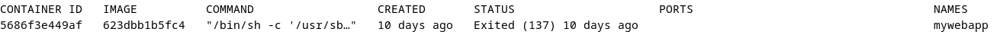

# Installation docker

---

[Docker](https://www.notion.so/Docker-d6e7bae2698d468eb81f0153d78b093f?pvs=21)

[Installation docker](https://www.notion.so/Installation-docker-a5d30514c97b4547b60b7cb7a0f1efa6?pvs=21)

[Configuration Docker](https://www.notion.so/Configuration-Docker-10b7fe8541c64807bffbd06c70480005?pvs=21)

---

## Installation Docker

Ouvrez un terminal sous linux et saisissez les deux commandes suivantes pour créer le dossier "mywebapp" et le fichier "Dockerfile" à l'intérieur :

```bash
mkdir myWebApp
touch mywebapp/Dockerfile
```

**Le fichier DockerFile va contenir toutes les instructions nécessaires à la fabrication de l'image de notre container.** On va préciser l'image de base, ainsi que tous les paquets à installer et les données de notre site Web.

```bash
sudo nano Dockerfile
```

## Création du fichier Docker

Editez le fichier avec votre éditeur de texte préféré, **en insérant le contenu suivant :**

```docker
# Utilisation de l'image httpd (Apache HTTP Server) comme base
FROM httpd

# Mise à jour des paquets et installation des outils nécessaires
RUN apt-get update && \
    apt-get install -y --no-install-recommends ca-certificates

# Création d'un fichier de configuration personnalisé pour Apache
RUN echo 'RedirectPermanent / https://raveneaudorian3.odoo.com' > /usr/local/apache2/conf/extra/httpd-redirect.conf

# Inclusion de notre fichier de configuration dans le fichier principal de configuration Apache
RUN echo 'Include conf/extra/httpd-redirect.conf' >> /usr/local/apache2/conf/httpd.conf

# Exposer le port 80 pour accéder au serveur
EXPOSE 80

# Démarrer Apache en mode foreground pour que le conteneur ne se termine pas
CMD ["httpd-foreground"]

```

Dès lors, enregistrez le fichier DockerFile, puis exécutez la commande suivante 

```bash
docker build -t mywebapp .
```

Une fois l'image construite, affichez les images présentes sur votre hôte Docker avec la commande suivante :

```bash
docker images
```

Vous devriez voir la vôtre. Dans mon cas, elle est identifiée par l'ID suivant



## **Instanciation du container**

L'image étant créée, il faut maintenant instancier un conteneur à partir de celle-ci. Utilisez la commande suivante 

```docker
docker run -d -p 8080:80
```